## アプリ名
MyShop

## 概要
販売者は自分の手でつくった商品だけを並べられるマイページを作成し、一つ一つ紹介しながら販売することができます。  
また、購入者はお気に入りのお店を探しながら商品を購入することができ、お気に入り登録することでトップページから簡単にアクセスすることができます。  

## 制作背景（意図）
あるこだわりを持ってつくられた商品と、そのこだわりが必要な方をもっと簡単に繋げたい！と思い作成しました。  
例えば、無農薬で育てられた野菜、金属アレルギーの方を考慮して作成されたアクセサリー、リクエストに応じて描かれた絵画など。そして同じ種類の商品でもアピールポイントは様々だと思います。  
こういった商品を店舗の大小関係なく思う存分アピール出来る、自分のこだわりや製作者だから知っている情報を発信出来るようなアプリにしたいです。
そして、あらゆる理由で購入する商品のサイズや原料などに気を付けなければならないことがある方が、自分の理想と少しでも近い商品と少しでも簡単に楽しく巡り会えたらいいなと思います。

## DEMO
### ・トップページ
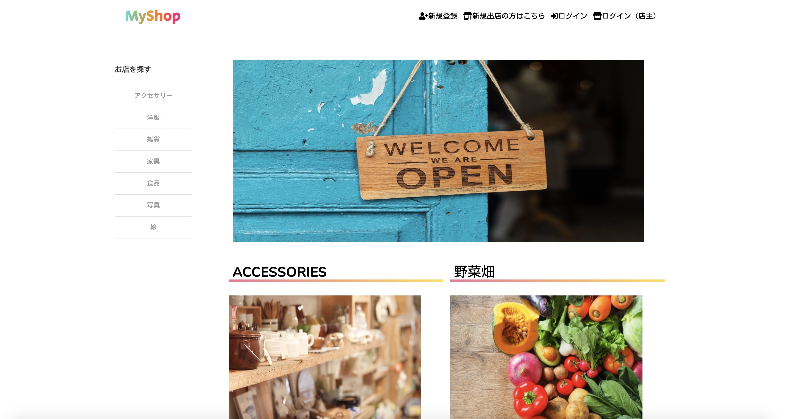

### ・新規登録画面
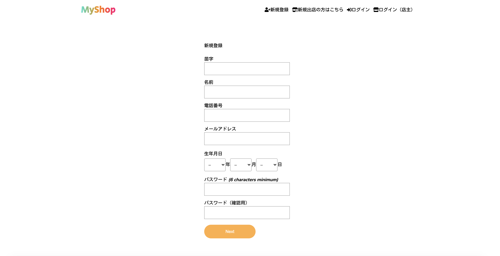
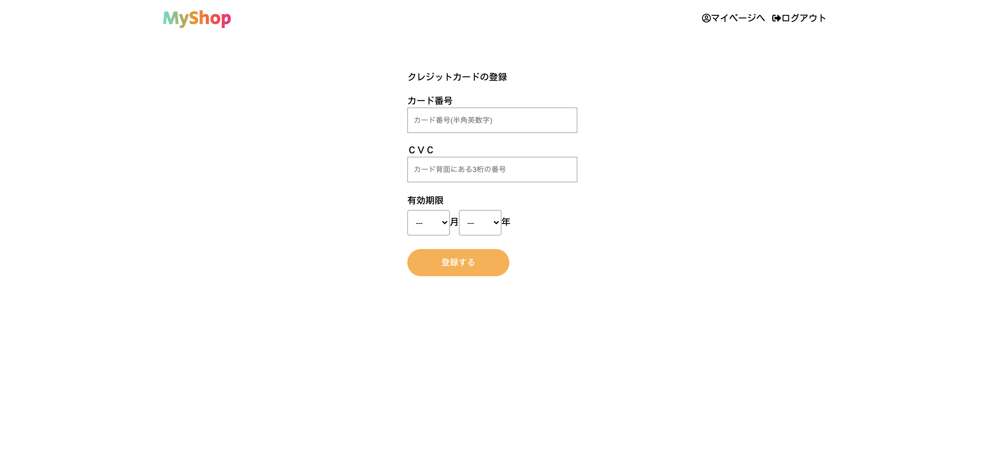
販売者と購入者の新規登録画面は同様ですが、購入者側はクレジットカード登録が可能です。

### ・新規出店画面
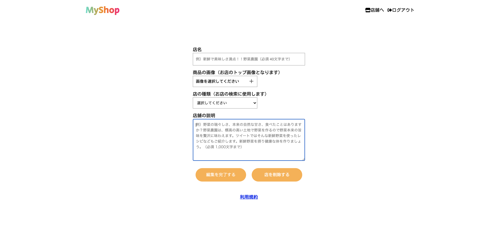
販売者は新規登録後、マイページ（自分の店舗）の編集に移ります。

### ・店舗詳細画面
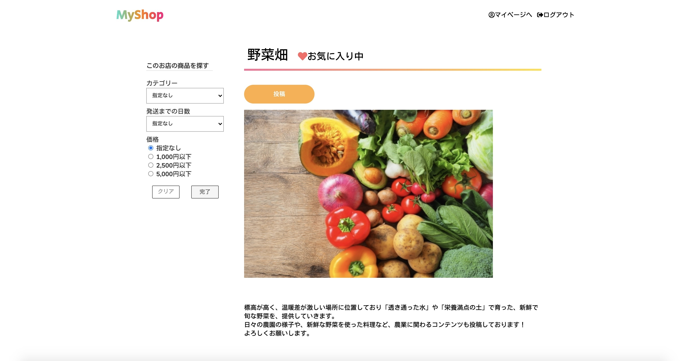
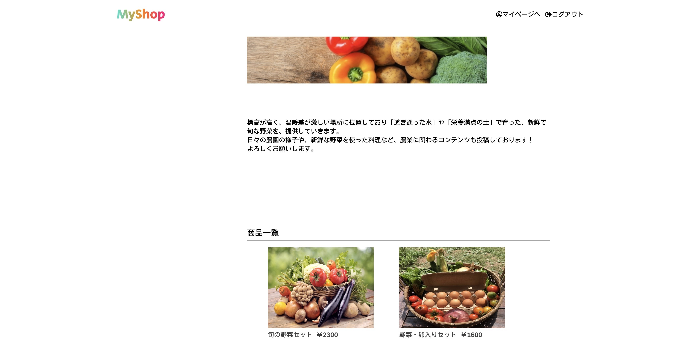
購入者はこの画面でお気に入り登録/解除が可能です。  
また販売者の画面では店舗編集/出品のリンクがあります。

### ・商品詳細画面
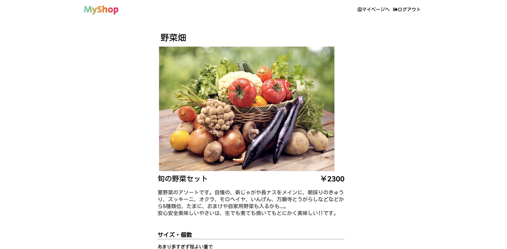
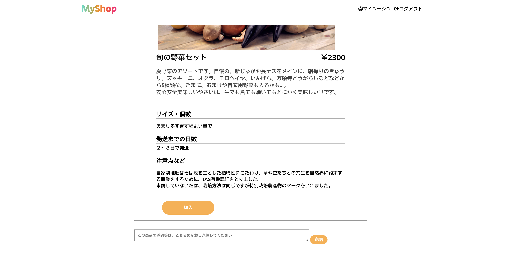
この商品について何か質問などがあれば、この画面でコメントを送信します。

### ・購入画面
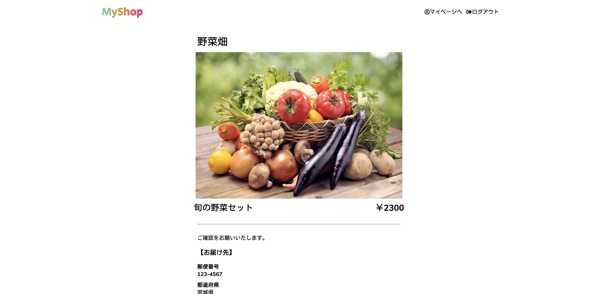
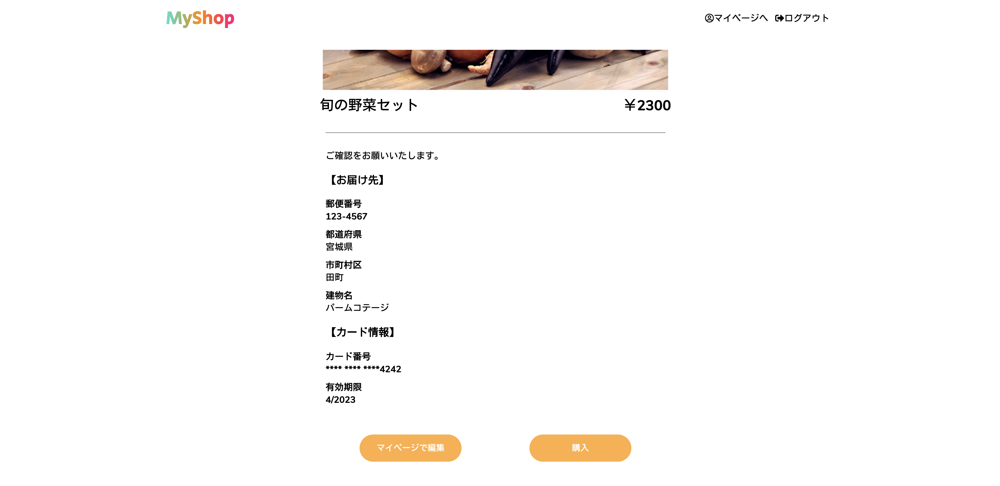

### ・投稿画面
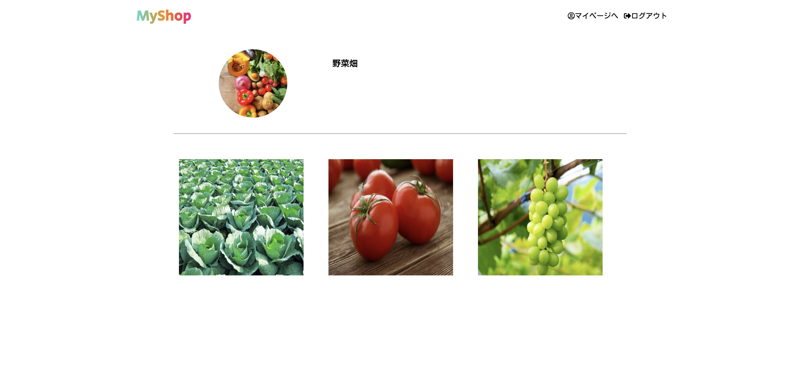
店舗ごとの投稿一覧をみることができます。

### ・投稿詳細画面
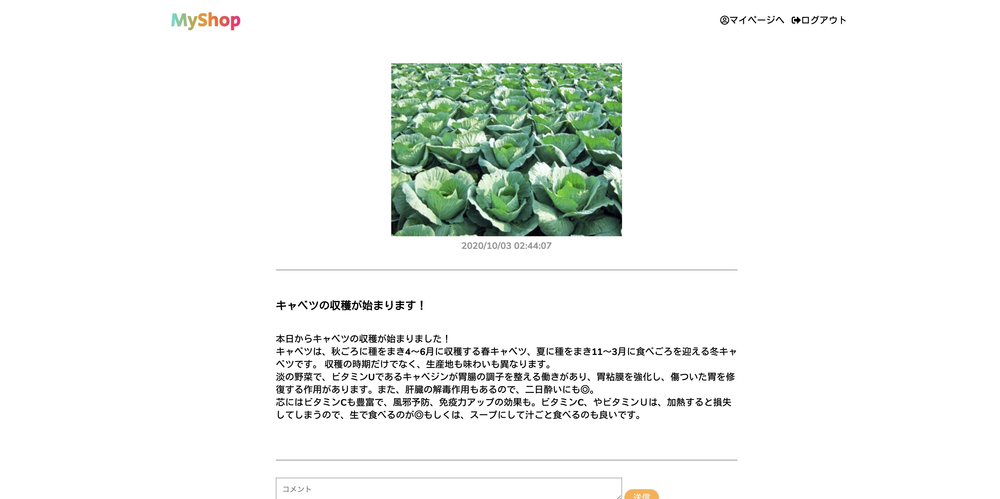
投稿についてコメントを送信できます。

### ・お気に入り画面
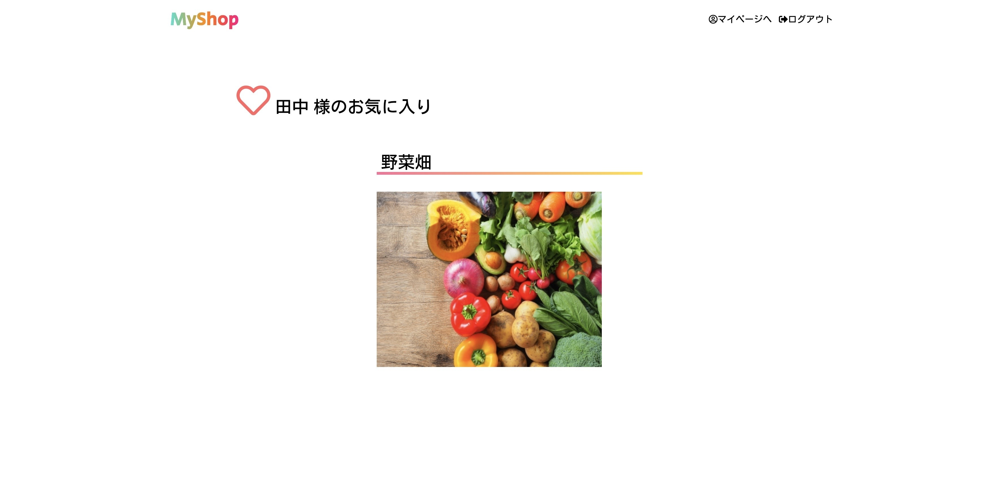
購入者がお気に入りに登録した店舗のみ表示されます。

## 課題や今後実装したい機能
・エラー文の日本語化が最後まで進んでいないので、整える  
・投稿に対するいいね機能を実装する  
・写真投稿を複数枚可能にする  
・購入が決まった商品の画面表示について考える  
・できれば在庫を管理し、それに応じて完売なのか販売中なのか分かる表示を実装したい  

## DB設計

### shopkeeper テーブル
| Column          | Type       | Options                        |
| --------------- | ---------- | ------------------------------ |
| family_name     | string     | null: false                    |
| first_name      | string     | null: false                    |
| email           | string     | null: false                    |
| password        | string     | null: false                    |
| phone_num       | string     | null: false                    |
| birthday        | date       | null: false                    |

has_one :shop, dependent: :destroy  
has_one :address, dependent: :destroy  
has_many :tweets, dependent: :destroy  
has_many :itemcomments, dependent: :destroy  
has_many: tweets, dependent: :destroy  
has_many :tweetcomments, dependent: :destroy  

### address テーブル

| Column           | Type       | Options                        |
| ---------------- | ---------- | ------------------------------ |
| postal_code      | string     | null: false                    |
| prefecture_id    | integer    | null: false                    |
| city             | string     | null: false                    |
| house_num        | string     | null: false                    |
| building_name    | string     |                                |
| shopkeeper       | references |                                |

belongs_to :shopkeeper,  optional: true  
belongs_to_active_hash, :prefecture  

### shop テーブル
| Column              | Type       | Options                        |
| ------------------- | ---------- | ------------------------------ |
| name                | string     | null: false                    |
| text                | text       | null: false                    |
| itemcategory_id     | bigint     | null: false, foreign_key: true |
| shopkeeper          | references | null: false, foreign_key: true |

belongs_to :shopkeeper  
belongs_to :itemcategory  
has_many :items, dependent: :destroy  
has_many :tweets, dependent: :destroy  
has_many:favorites, dependent: :destroy  
has_many: customers, trhough: :favorites  
has_one_attached :image  

### customer テーブル
| Column          | Type       | Options                        |
| --------------- | ---------- | ------------------------------ |
| nickame         | string     | null: false                    |
| family_name     | string     | null: false                    |
| first_name      | string     | null: false                    |
| email           | string     | null: false                    |
| phone_num       | integer    | null: false                    |
| birthday        | integer    | null: false                    |
| password        | string     | null: false                    |

has_many :itemcomments, dependent: :destroy  
has_many :tweetcomments, dependent: :destroy  
has_many :purchases  
has_many :favorites, dependent: :destroy  
has_one :residence, dependent: :destroy  
has_one :card, dependent: :destroy  

### address テーブル

| Column           | Type       | Options                        |
| ---------------- | ---------- | ------------------------------ |
| postal_code      | string     | null: false                    |
| prefecture_id    | integer    | null: false                    |
| city             | string     | null: false                    |
| house_num        | string     | null: false                    |
| building_name    | string     |                                |
| customer         | references |                                |

belongs_to :customer, optional: true  
belongs_to_active_hash, :prefecture  

### card テーブル
| Column           | Type       | Options                        |
| ---------------- | ---------- | ------------------------------ |
| card_token       | string     | null: false                    |
| customer_token   | string     | null: false                    |
| customer         | references | null: false, foreign_key: true |

belongs_to :customer  

### item テーブル
| Column          | Type       | Options                        |
| --------------- | ---------- | ------------------------------ |
| name            | text       | null: false                    |
| price           | integer    | null :false                    |
| text            | references | null: false                    |
| itemcategory_id | bigint     | null: false,foreign_key: true  |
| size            | text       | null: false                    |
| shipfrom_id     | integer    | null: false                    |
| shipday_id      | integer    | null: false                    |
| information     | text       | null: false                    |
| shop            | references | null: false, foreign_key: true |
| shopkeeper      | references | null: false, foreign_key: true |

belongs_to :shop  
belongs_to :shopkeeper  
belongs_to :itemcategory  
has_one :purchase  
has_one :itemcomments  
has_one_attached :image  
belongs_to_active_hash :shipday  
belongs_to_active_hash :shipfrom  

### purchase テーブル
| Column          | Type       | Options                        |
| --------------- | ---------- | ------------------------------ |
| item            | references | null: false, foreign_key: true |
| customer        | references | null: false, foreign_key: true |

belongs_to :item  
belongs_to :customer  

### itemcomment テーブル
| Column          | Type       | Options                        |
| --------------- | ---------- | ------------------------------ |
| text            | text       | null: false                    |
| item            | references | null: false, foreign_key: true |
| shopkeeper      | references | foreign_key: true              |
| customer        | references | foreign_key: true              |

belongs_to :item  
belongs_to :shopkeeper, optional :true  
belongs_to :customer, optional :true  

### itemcategory テーブル
| Column          | Type       | Options                        |
| --------------- | ---------- | ------------------------------ |
| name            | string     | null: false                    |
| ancestry        | string     |                                |

has_many :items  
has_ancestry  

### tweet テーブル
| Column          | Type       | Options                        |
| --------------- | ---------- | ------------------------------ |
| title           | string     | null: false                    |
| text            | text       | null: false                    |
| shopkeeper      | references | null: false, foreign_key: true |
| shop            | references | null: false, foreign_key: true |

belongs_to :shopkeeper  
belongs_to :shop  
has_many :tweetcomments  
has_one_attached :image  

### tweetcomment テーブル
| Column          | Type       | Options                        |
| --------------- | ---------- | ------------------------------ |
| text            | text       | null: false                    |
| item            | references | null: false, foreign_key: true |
| shopkeeper      | references | foreign_key: true              |
| customer        | references | foreign_key: true              |

belongs_to :item  
belongs_to :shopkeeper, optional :true  
belongs_to :customer, optional :true  

### favorite テーブル
| Column          | Type       | Options                        |
| --------------- | ---------- | ------------------------------ |
| customer        | references | null: false, foreign_key: true |
| shop            | references | null: false, foreign_key: true |

belongs_to :customer  
belongs_to :shop  
